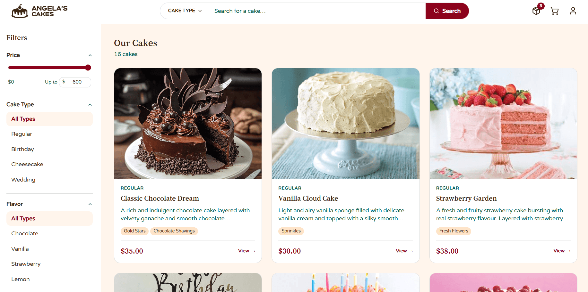
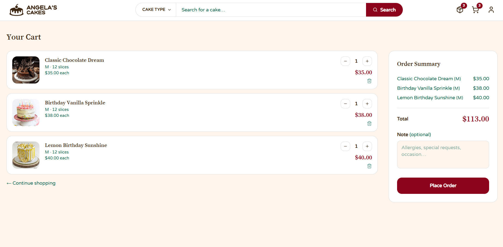
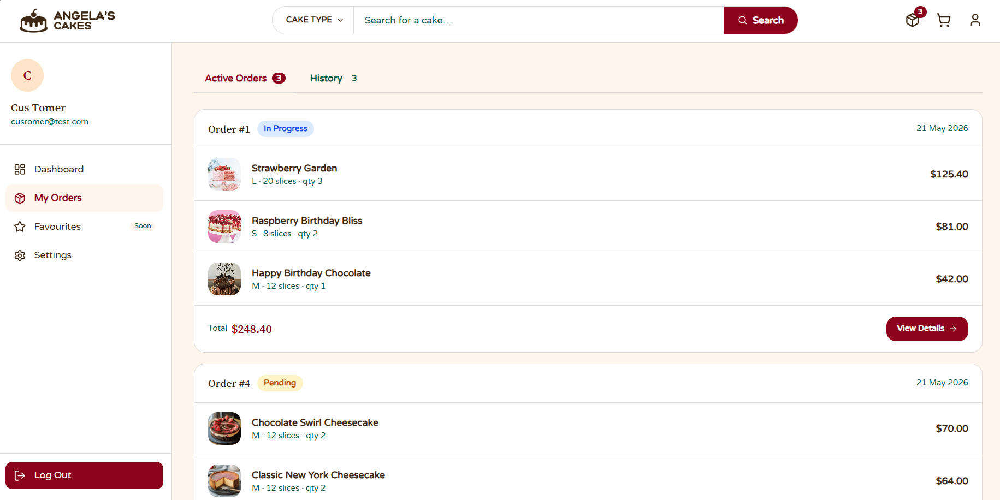
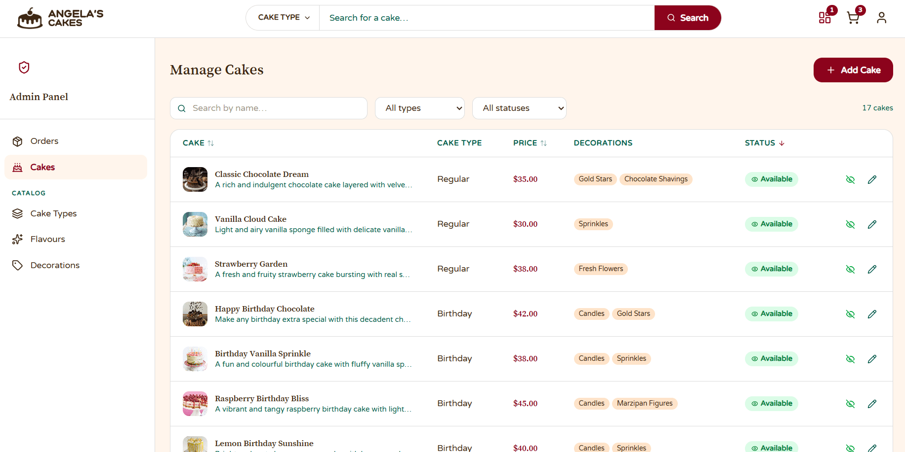

# Angela's Cakes

Webová aplikace pro online objednávání dortů. Zákazníci mohou procházet katalog, přidávat dorty do košíku a sledovat své objednávky. Administrátor spravuje nabídku dortů a zpracovává objednávky.

---

## Technologie

**Backend:** Java 21 · Spring Boot 3 · Spring Security (JWT) · Spring Data JPA · H2  
**Frontend:** React 19 · Vite · Tailwind CSS v4 · Zustand · React Router DOM v7

---

## Ukázka aplikace

### Uživatelský katalog



### Košík



### Aktivní objednávky



### Administrace dortů



---

## Spuštění

### Backend

```bash
cd backend
./mvnw spring-boot:run
```

Běží na `http://localhost:8080`

### Frontend

```bash
cd frontend
npm install
npm run dev
```

Běží na `http://localhost:5173`

---

## Výchozí administrátorský účet

| E-mail                 | Heslo    |
| ---------------------- | -------- |
| admin@angelascakes.com | admin123 |

---

## Dokumentace

Složka `dokumentace/` obsahuje:

- `SRS.pdf` – Specifikace softwarových požadavků
- `SDD.pdf` – Dokument softwarového návrhu
- `PRIRUCKY.pdf` – Uživatelská a administrátorská příručka
